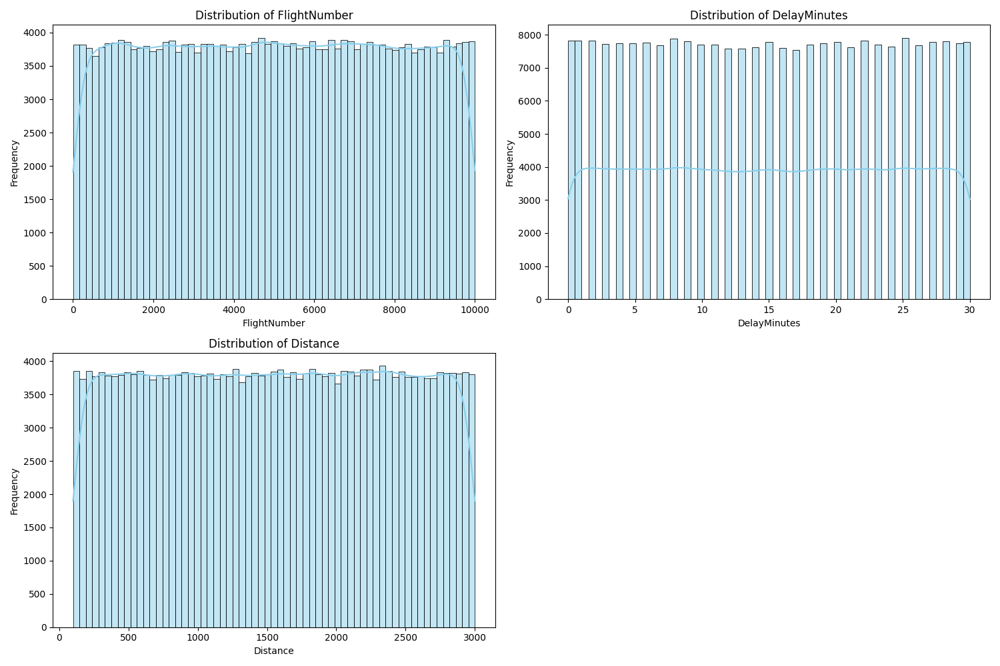

### Predicting Flight Delays

**Author**
Anupama Deshmukh

#### Executive summary
Predict the likelihood and extent of flight delays based on historical data and current conditions. 
This prediction would make passengers travel easy and enjoyable, in addition to other benefits that are 
mentioned in the expected results
ii.	Key findings :  
Addressing maintenance issues and enhancing operational resilience to external factors. 
(weather and Traffic control) are vital for improving airline performance and customer experience. 
               
Frequency of Delays: "Maintenance", “Weather”,”Trafic Control” and "Other Reasons" are primary contributors to delays,
                     indicating operational challenges and unexpected issues prevalent in the industry.
Airline Performance: Analysis reveals that the reasons for delays are relatively consistent across airlines, 
                     pointing to common industry-wide challenges such as air traffic control delays.
Operational Factors: The prevalence of maintenance-related delays raises concerns about potential aging fleet 
                     issues or a strong commitment to safety checks. Further investigation is warranted to determine 
                     the root causes, guiding future recommendations for maintenance or aircraft replacement.
External Influences: While weather-related delays are less frequent compared to maintenance, they still pose
                     a significant risk to overall performance. An airline's ability to manage these delays is 
                     crucial for maintaining customer satisfaction.
                     Further analysis and targeted strategies are recommended to mitigate these delays effectively
#### Rationale
Data Trends: Historical data shows patterns in delays based on time of day, season, and airport congestion. 
For instance, certain routes may consistently experience delays during peak travel times.
Weather Impacts: Historical weather data can indicate how often certain weather conditions lead to delays.

Current Conditions:
Weather Forecasts  : Real-time weather updates (like storms or heavy winds) can significantly impact flight schedules.
Air Traffic Control: Certain routes are more prone to delays due to air traffic patterns or geographic factors.
Other Factors      : Festival travels, conferences and Special Events can increase passenger volumes, 
                     impacting flight schedules
Real-time Tracking : Integrating live data from various sources (weather, airport status, etc.) enhances prediction 
                     accuracy.
Statistical Models : Utilizing machine learning algorithms or statistical methods can help in modeling and predicting 
                     delays based on the above factors.

#### Research Question
*Key Factors in Prediction*
Flight Route         : Certain routes are more prone to delays due to various reasons weather, maintenance, 
                       air traffic and other reasons
Historical Delay Data: Analyzing past delays for specific flights or airlines can provide insights.
Real-time Tracking   : Integrating live data from various sources (weather, airport status, etc.) 
                       enhances prediction accuracy.
Statistical Models   : Utilizing machine learning algorithms or statistical methods can help in modeling 
                       and predicting delays based on the above factors.

By combining these elements, airlines, passengers, and airport authorities can better manage schedules,
reduce inconveniences, and improve overall efficiency in air travel.

*Key Insights*:
1.	Flight Cancellations: Most flights listed were  canceled by all airlines. This indicates potential issues 
    with scheduling, airline capacity, or external factors affecting operations (e.g., weather, air traffic).
    o	United               30017
    o	Southwest            30013
    o	American Airlines    29961
    o	Delta                29779
2.	Delays:
    o	Max Delay is for the 'Route': 'ATL to MIA', with 30 minutes
    o	The average delay for each airline is minimum 14+ minutes

    Airline  AverageDelay (in min)
    0  American Airlines     15.02
    1              Delta     14.95
    2          Southwest     15.01
    3             United     14.97

3.	Airline Performance:
    o	Despite the delays, the Delta flight had the least delay, indicating potentially better operational efficiency 
      compared to the other airlines on that day.
    o	The Boeing 737 was used by both United and Southwest, which could point to a similar operational pattern or 
      challenges faced by these models in adverse weather conditions.

4.	Operational Factors:
    o	All flights experienced some level of delay or were canceled, reflecting broader challenges in airline operations on that day. This may have been exacerbated by external factors like weather and air traffic control.
    
    These insights can help in understanding the factors affecting flight operations and passenger experiences on 
    that particular day.

3	Methodology

i.	Problem Definition

    Title     : Identifying the Longest Distance Flights by Airline
    Background: In the aviation industry, understanding flight distances can provide insights into operational 
                efficiency, route planning, and passenger service. Airlines aim to optimize their networks and
               improve customer experience, making it essential to analyze the performance of different routes.
    Objective : The primary goal is to identify the longest distance flights for each airline in a given dataset.
                This analysis will help airlines assess their longest routes, understand operational challenges,
                and make informed decisions regarding fleet management and route optimization.

    In-Scope:

      •	The analysis will focus on a dataset that includes various attributes of flights, such as airline name,
        flight number, origin, destination, scheduled departure, actual departure, delays, and distance.
      •	The solution will identify the flight with the maximum distance for each airline.

      Longer flights may experience more significant operational challenges. Below are long distance flights by 
      various arilines 
      
      Longest Distance Flight by Airline
      
              Airline  FlightNumber  Distance Origin Destination
              9672   American Airlines          6841      3000    ATL         BOS
              3458               Delta          1055      3000    JFK         BOS
              794            Southwest          8028      3000    ATL         MIA
              12359             United          3919      3000    LAX         MIA

ii.	Algorithm Selection
i.	Grouping and Aggregation
  Aggregated Data:
             Airline         AverageDistance  TotalDelay
  0    American Airlines      1549.603349    896369.0
  1                Delta      1549.675105    893395.0
  2            Southwest      1552.740679    905234.0
  3               United      1551.238602    897244.0

Comparison Across Airlines using this aggregated dataset
•	Average Distance: 
    o	The average distances for the airlines in your dataset are relatively close, ranging from 
       approximately 1549.60 to 1552.74 miles.
    o	This suggests that the airlines might be operating similar types of routes (e.g., medium to long-haul flights).
•	Total Delay:
    o	The total delays vary among the airlines, with "Southwest" having the highest total delay of 905,234 minutes, 
      while "American Airlines" has the lowest at 896,369 minutes.
    o	The significant total delay numbers could indicate operational challenges or external factors 
      (like weather or air traffic control issues) affecting flight schedules.

4	Exploratory Data Analysis

The descriptive statistics provided summarize key aspects of flight delays and other relevant data for a dataset 
containing 239,582 flights. Here's a breakdown of the distribution of delay minutes along with insights relevant 
to business considerations:

Summary Statistics for Delay Minutes

•	Count: There are 239,582 recorded delays, indicating a substantial dataset to analyze.
•	Mean Delay: The average delay is approximately 15 minutes. This suggests that, on average, flights are delayed
              but typically not excessively.
•	Minimum Delay: The minimum delay recorded is 0 minutes, indicating that some flights were on time or even 
                  departed early.
•	Maximum Delay: The maximum delay is 30 minutes, suggesting that while delays are common, they rarely 
                 exceed this threshold in this dataset.
•	25th Percentile (Q1): The first quartile shows that 25% of flights are delayed by 7 minutes or less. 
                        This reflects a significant portion of flights experiencing minimal delays.

•	Median Delay (Q2): The median delay is 15 minutes, indicating that half of the flights are delayed by
                     15 minutes or less. This aligns with the mean delay.
•	75th Percentile (Q3): The third quartile indicates that 75% of flights are delayed by 23 minutes or less, 
                        showing that a majority of delays are relatively short.
•	Standard Deviation: The standard deviation is about 8.97 minutes, indicating that delays
                       tend to be clustered around the mean, with some variability.

Continuous monitoring of delay patterns and addressing underlying causes will be crucial for maintaining competitiveness in the airline industry.

Numeric and Categorical Variables:
Categorical Columns: ['Airline', 'Origin', 'Destination', 'ScheduledDeparture', 'ActualDeparture', 'ScheduledArrival', 'ActualArrival', 'DelayReason', 'AircraftType']

data/categorical_feature_distributions.png

data/numeric_feature_distributions.png

Airline: All airlines flight close number of flights on a given day, Southwest airlines have little more 
        flights than others

Business Implication: Analyzing delays or cancellations by airline can help identify performance trends, 
                      allowing for targeted improvements in operations, customer service, or marketing strategies.
5.	Visualization
	Equal Cancellation rates across all airlines

data/Cancellation Rates.png

Equal cancellation rates can indicate operational similarities and shared challenges among airlines,
prompting a need for strategic reassessment. By focusing on enhancing operational efficiency, customer experience, and brand differentiation, airlines can navigate the implications of similar cancellation rates effectively, maintaining competitiveness in a challenging market.

data/flight_delay_distribution2.png

All the flights were delayed by all airlines due to various reasons.  Weather, Air Traffic Control and Maintenance 
are major reasons for delay. There are also other reasons like seasonality, festivals, group events, that can cause 
delays. 
Analyzing delays by reason provides airlines with critical insights into their operational performance and 
customer satisfaction. By understanding the underlying causes of delays, businesses can implement targeted 
strategies to improve efficiency, enhance the passenger experience, and maintain a competitive edge in the industry.
 

6.	Pre-Processing
o	 Perform hot-encoding
o	 Perform Label encoding
o	 Fit and transform the categorical columns

7.	Modeling 
    Linear Regression is used for modeling . Find out MSE and R2 scores, compare and finally display predicted vs actual
    values	
    Results:
    Mean Squared Error: 80.064      R^2 Score: -8.10

Business Impact: 
An MSE of 80.06 suggests that, on average, the model's predictions deviate from actual values by a squared error of 
about 80. This level of error may be considered significant, depending on the context. This inconsistency could lead
 to operational inefficiencies or poor customer communication.

 A negative R² score indicates that the model performs worse than a simple mean prediction. This could signal that the chosen features or model may not be capturing the underlying patterns affecting flight delays. For the business, this means that current predictive efforts may not be reliable and that further investigation into feature selection, data quality, or model choice is necessary

Actual vs. Predicted Values

Business Impact: Overestimating delays can lead to unnecessary operational adjustments, 
such as scheduling additional staff or resources that may not be needed. This could incur extra costs 
and negatively affect customer service if adjustments lead to delays in updates.

8.	Recommendations for Business
Model Refinement: Given the high MSE and low R², consider revisiting the feature set, exploring additional features 
                  that may impact delays (e.g., weather conditions, historical trends).
Model Selection: Experiment with different modeling techniques (e.g., ensemble methods, more complex algorithms) 
                 to improve prediction accuracy.
Error Analysis: Conduct a deeper analysis of prediction errors to understand patterns and refine the model further.
Communication Strategies: If predictions remain unreliable, ensure that customer communications about potential 
                          delays are clear and consider adding buffers to estimated delay times.

                           By addressing these points, the airline can improve its predictive modeling efforts, 
                          leading to better operational planning and enhanced customer satisfaction.

